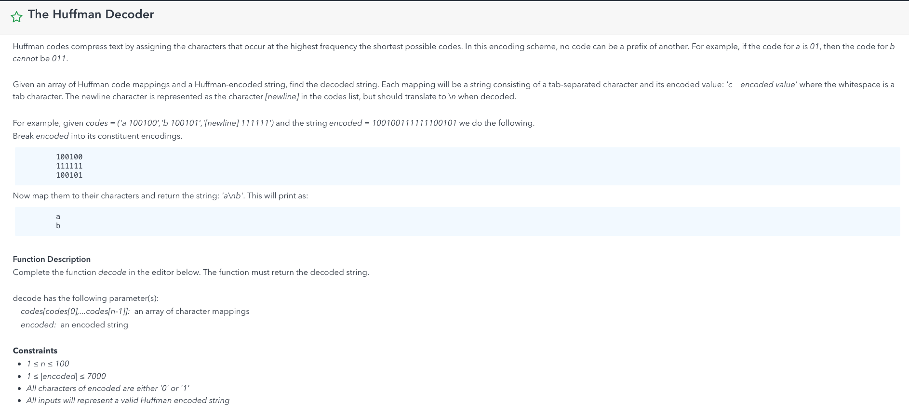
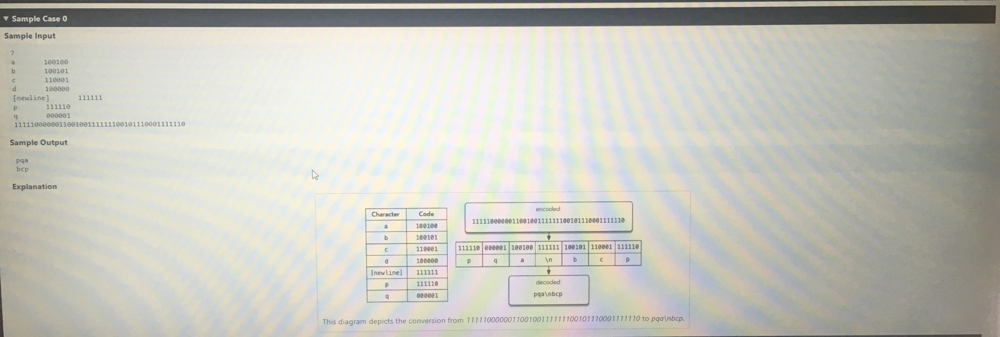

# Huffman Decoding





```java
import java.util.HashMap;
import java.util.Map;

public class HuffmanDecoder {
    private static String huffmanDecoder(String[] dict, String input)
    {
        if(input == null || input.length() == 0) return null;

        Map<String, String> map = new HashMap<>();

        for(int i = 0; i < dict.length; i++)
        {
            String[] temp = dict[i].split(" ");
            if(temp[0].equals("newline"))
            {
                map.put(temp[1], "\n");
            }else
            {
                map.put(temp[1], temp[0]);
            }
        }

        StringBuilder sb = new StringBuilder();
        int start = 0, end = 1;
        while(start < input.length() && end <= input.length())
        {
            String temp = input.substring(start, end);
            if(map.containsKey(temp))
            {
                sb.append(map.get(temp));
                start = end;
                end = start + 1;
            }else
            {
                end++;
            }
        }

        return sb.toString();
    }


    public static void main(String[] args)
    {
        String[] dict = {"a 100100", "b 100101", "c 110001", "d 100000", "newline 1111111", "p 111110", "q 000001"};
        String input = "1111100000011001001111111100101110001100000";
        System.out.print(huffmanDecoder(dict, input));
    }
}

```

