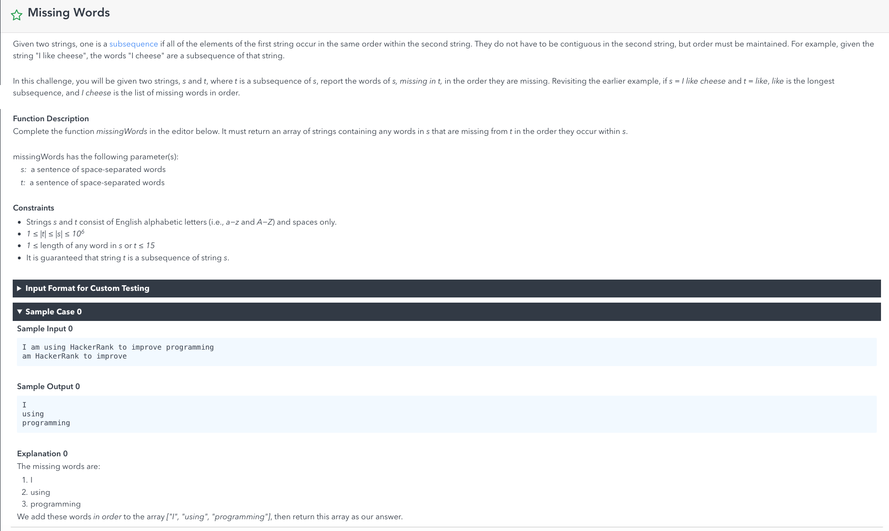

# Missing Words




```java
import java.util.ArrayList;
import java.util.List;

public class MissingWord {

    private static List<String> missingWords(String str1, String str2)
    {
        List<String> res = new ArrayList<>();
        String[] aList = str1.split(" ");
        String[] bList = str2.split(" ");

        int bPtr = 0, aPtr = 0;

        while(bPtr < bList.length)
        {
            String bTemp = bList[bPtr];
            while(aPtr < aList.length)
            {
                String aTemp = aList[aPtr];
                if(aTemp.equals(bTemp))
                {
                    aPtr++;
                    bPtr++;
                    break;
                }else
                {
                    res.add(aTemp);
                    aPtr++;
                }
            }
        }

        //check whether there is still missing
        while(aPtr < aList.length)
        {
            res.add(aList[aPtr]);
            aPtr++;
        }
        return res;
    }


    public static void main(String[] args)
    {
        String str1 = "I am using HackerRank to improve programming";
        String str2 = "am HackerRank to improve";
        for (String str : missingWords(str1, str2)) {
            System.out.println(str);
        }
    }
}

```


