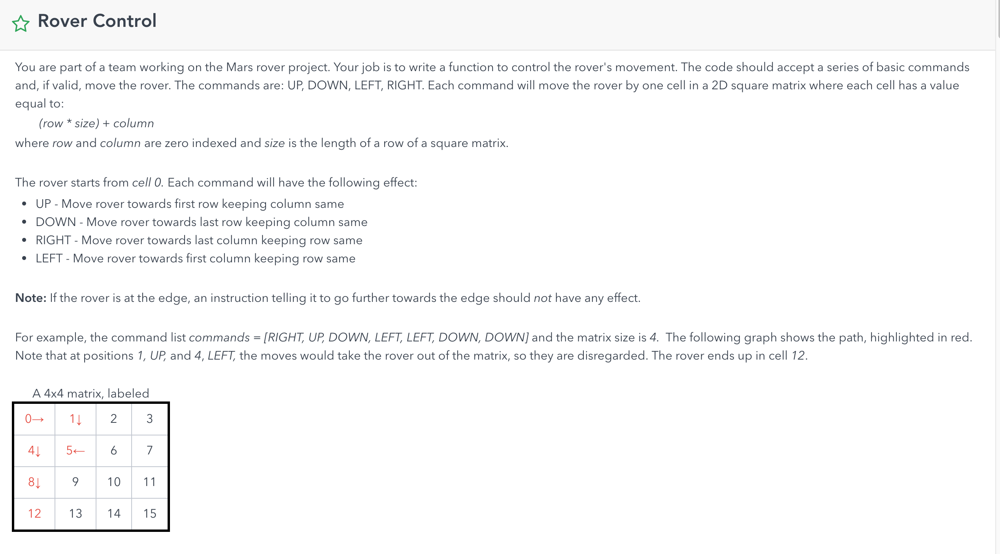
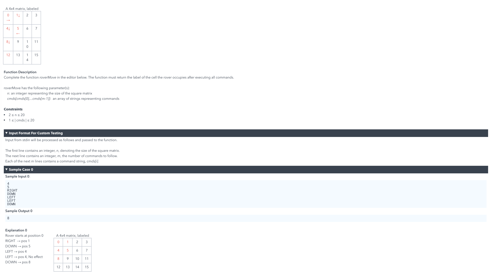

# Rover Control





```java
import java.util.HashMap;
import java.util.Map;

public class RoverControl {
    private static int roverMove(int size, String[] cmds)
    {
        int[] start = {0,0}; // starts from (0,0)
        Map<String, int[]> map = new HashMap<>();
        map.put("UP", new int[]{0,-1});
        map.put("DOWN", new int[]{0,1});
        map.put("RIGHT", new int[]{1,0});
        map.put("LEFT", new int[]{-1,0});

        for(String cmd: cmds)
        {
            int[] operations = map.get(cmd);
            if(start[0] + operations[0] < 0 || start[0] + operations[0] >= size || start[1] + operations[1] < 0 || start[1] + operations[1] >= size)
            {
                continue;
            }
            start[0] += operations[0];
            start[1] += operations[1];
        }

        return start[1] * size + start[0];
    }

    public static void main(String[] args) {
        String[] cmds = {"RIGHT", "DOWN", "LEFT", "LEFT", "DOWN"};
        String[] cmds2 = {"RIGHT", "UP", "DOWN", "LEFT", "LEFT", "DOWN", "DOWN"};
        System.out.println(roverMove(4, cmds));
        System.out.println(roverMove(4, cmds2));
    }
}

```

